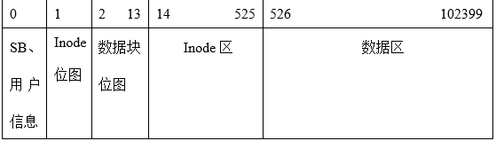

# Simple File System in Rust

Linux下基于Rust异步IO编写的简单文件系统

- simdisk 磁盘管理程序
    - 具有基本的增删查改功能
- shell 交互程序
    - 通过异步IO与socket链接simdisk传输命令
## 结构设计

### 文件系统

- 建立一个100MB的大文件，作为文件系统所拥有的磁盘
- 块大小1KB，使用位图管理空闲块和inode管理文件系统
- 采用直接索引和间接索引，支持多级目录
- 布局如下
    - 超级块占用一块
    - inode 大小64B, 位图占用一块
        - 1KB/1b*1=8192 最多表示8192个目录项
        - 因此inode区占用(8192*64B)/1KiB = 512 块
    - 寻址支持8个直接地址，1个一级地址和1个二级地址，地址用32bit表示
        - 单个文件最大大小为 1024 *(8 + 1 *(1024/4) + 1 *(1024/4)^2) = 64.25 MB
    - data 位图占用12块
        - 12 *1024 *8 *1024 = 96M, 最多能表示96MB的数据
        - 剩余的块有101874块，能存储99.49MB的文件，即数据区块有富余 
<p align="center">
  
</p>

### 超级块
```rust
pub struct SuperBlock { // 无需在意大小
    magic: usize,   //魔数
    fs_size: usize, // 文件系统大小，块为单位

    // inode info
    first_block_of_inode_bitmap: usize, // inode位图区起始块号
    inode_bitmap_size: usize,           // inode位图区大小，块为单位
    first_inode: usize,                 // inode区起始块号
    inode_area_size: usize,             // inode区大小 ，块为单位

    // data info
    first_block_of_data_bitmap: usize, // 数据块位图 起始块号
    data_bitmap_size: usize,           // 数据块位图大小 ，块为单位
    first_data_block: usize,           // 数据区第一块的块号，放置根目录
    data_size: usize,                  // 数据区大小，块为单位
}
```
### Inode
```rust
pub struct Inode { //共64B(内存对齐后)
    inode_id:       u16,        // inode 号
    inode_type:     InodeType,
    mode:           FileMode,   // 权限
    nlink:          u8,         // 硬连接数
    gid:            u16,        // 组id
    uid:            u16,        // 用户id
    size:           u32,        // 文件大小
    time_info:      u64,        // 时间戳
    addr:           [u32; 10],  // 地址数组
}
```
### 目录项
```rust
pub struct DirEntry {//16B(对齐后)
    filename:  [u8; 10],    //文件名：10B
    extension: [u8; 3],     //扩展名: 3B
    is_dir:    bool,        //目录标志
    inode_id:  u16,         //inode号: 2B
}
```

## 功能
- info
    - 显示文件系统的信息，类似df -h && df -i
- dir
    - dir [path] [/s]
    - 展示当前或指定目录的信息，/s展示详细信息
- cd
    - cd [path]
    - 移动到指定目录，支持绝对路径和相对路径
- md
    - md [path]
    - 创建目录：在指定路径或当前路径下创建指定目录。重名时给出错信息
- rd
    - rd [path]
    - 删除目录：删除指定目录下所有文件和子目录。要删目录不空时，要给出提示是否要删除。
- newfile
    - 建立文件，支持绝对路径, ctrl+D 结束输入
- cat
    - 打印文件内容
- copy
    - copy [source path] [target path]
    - 拷贝文件，支持从host系统拷贝，只需在源文件的绝对路径前加上\<host>即可
- del
    - 删除文件：删除指定文件，不存在时给出出错信息。
- check
    - 检测并修复超级块、位图错误（强制复写超级块、位图将不必要的1修复为0）
- formatting
    - 格式化文件系统（清空）
- help
    - 打印指令列表
- EXIT
    - 退出shell
- users
    - root下打印所有用户信息
## 使用

### 从源码编译

- 在simdisk/下运行 `cargo run --release`启动后台管理程序，首次使用或者超级块被破坏会执行初始化，创建`SIMPLE_FS`文件作为系统载体
- 然后在shell/下运行`cargo run --release`打开shell，支持多个shell同时连接simdisk

### 从二进制

- 先打开simdisk，自动初始化后再打开shell即可使用